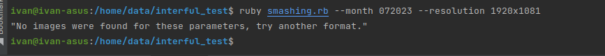
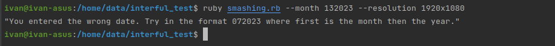
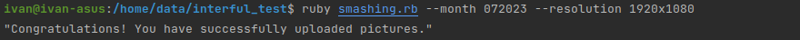

**In this script used Ruby version 3.1.0**

**This script is designed to automate the receipt of images on the site.**

To use the script, you can enter a file name, specify the month and resolution of the image you want to download from
the site.

**To enter correctly, follow the instructions below:**
ruby smashing.rb --month 072023 (format month/year) --resolution 1920x1080 (An indication of the size that you can find
on the site.)

**ruby smashing.rb --month 072023 --resolution 1920x1080**

**It is also worth noting that on the site the monthly report starts from February, and January is the 12th month.**

**When you enter an image size that is not on the site, you get an error that no images were found with these
parameters.
**

**When you enter the wrong date, in the wrong format, you also get a message about it.
**

**When you enter everything correctly, you will receive a message about the successful upload of pictures.
**
